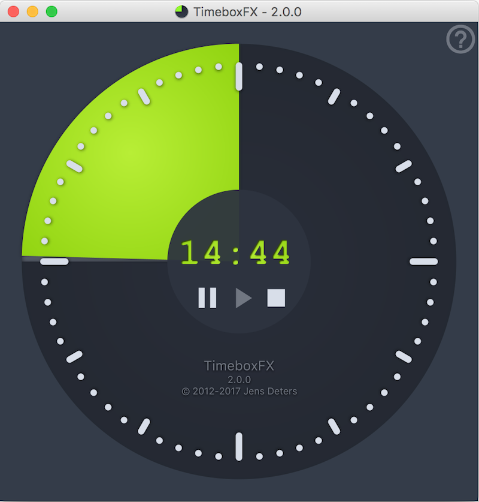
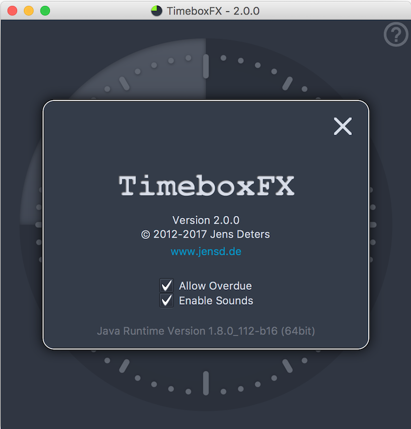

#TimeboxFX

**A JavaFX based timer for timeboxed meetings.**

When I started with JavaFX in 2012 TimeboxFX was one of my first JavaFX apps.
Recently in a meeting I wanted to use it as a gimmick and I found out that TimeboxFX needed some love... So here is the new version.




## Download
| Download      |            | run|
| ------------- |:-------------:|----| 
|FactJar|[Downlaod](http://jensd.de/apps/timeboxfx/TimeboxFX-2.0.0.jar)|java -jar TimeboxFX-2.0.0.jar|
|MacOS DMG|[Download](http://jensd.de/apps/timeboxfx/TimeboxFX_macos_2_0_0.dmg)||
|Windows 32bit|[Download](http://jensd.de/apps/timeboxfx/TimeboxFX_windows_2_0_0.exe)||
|Windows 64bit|[Download](http://jensd.de/apps/timeboxfx/TimeboxFX_windows-x64_2_0_0.exe)||

## Usage
Just drag your mouse to increase/decrase the wanted timer value.

Use the button to ```start/stop/pause``` the timer.

**Alternatively you can use your keyboard:**

|Key | does |
|---|---|
|```CURSOR_LEFT``` or ```CURSOR_UP```|increase the start time|
|```CURSOR_RIGHT``` or ```CURSOR_DOWN```|decrease the start time|
|```SPACE```|start the timer|
|```ÈNTER``` or ```ÈSC```|reset the timer|

